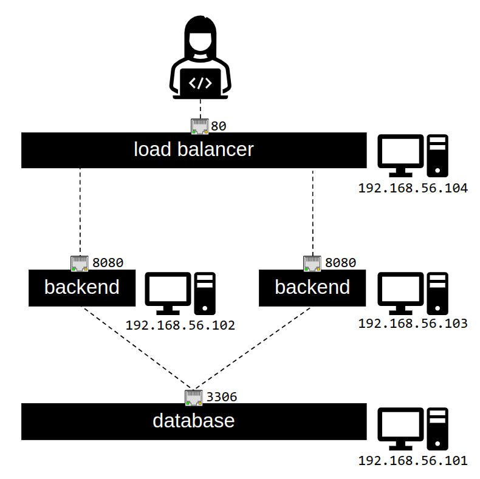

# Demo Ansible

## Introducción
La siguiente demo tiene como objetivo desplegar una aplicación sencilla en Go sobre la arquitectura mostrada en la siguiente imagen:​ ​ 



## Requisitos
- Se requiere una máquina Linux que permita la virtualización, con al menos 4 CPUs y 4Gb de memoria disponibles para virtualizar.
- Se requieren Python, ssh, curl, Ansible y Vagrant en el sistema.


## Aplicación
La aplicación, ya compilada, se encuentra en `roles/app/files/app` y consiste en un servicio que expone dos endpoints:​ 

- Un `GET` a `/` nos permite consultar la lista de datos almacenados en una tabla de mariadb.​ 
- Un `POST` a `/save` nos permite crear una nueva entrada en la base de datos con el timestamp de la petición.​ ​ 

El despliegue estará automatizado con Ansible. La creación de las máquinas virtuales estará automatizada con Vagrant.

## Despliegue

Puedes inicar el despliegue de las máquinas virtuales que usaremos como hosts gestionados con el comando:
```
vagrant up
```
**Nota**. Este proceso puede tomar algo de tiempo.

Puedes inicar el despliegue de la aplicación sobre los nodos ya desplegados con el comando:
```
ansible-playbook site.yml
```


## Pruebas

Si el proceso de despliegue ha concluido satisfactoriamente, puedes acceder al servicio con el comando:
```
curl 192.168.56.104
```

Para añadir nuevas entradas con el *timestamp* a la base de datos, puedes usar el comando:
```
curl -X POST 192.168.56.104/save
```

---

**_This project was developed by [Gradiant](https://www.gradiant.org)._**